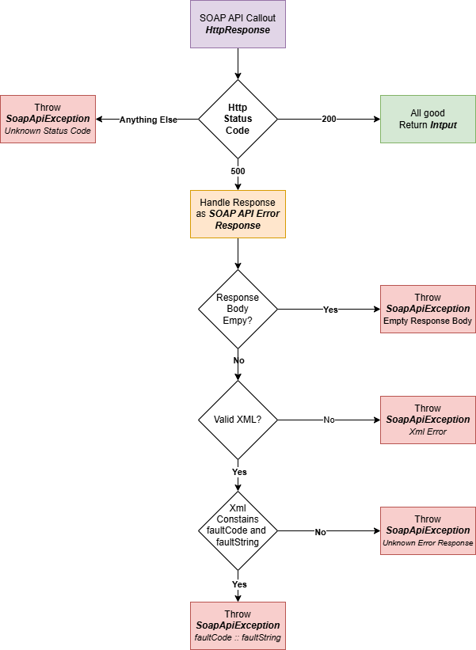

# Lightweight - SOAP API Util
A lightweight utility to call the synchronous methods of the Salesforce SOAP APIs on any Org, using the WSDLs. Included are the Metadata, Partner and Apex API WSDLs.
This library comes with a set of optional "Response Handlers" for each API type. These can be used to handle the parsing of the XML Response body to a usable apex class.

This library is modular and can be customized if you only need certain parts in your project. It's goal is to have a lightweight alternative for the well established metadata API from financial force. (It's not to compete, but more an alternative for small metadata implementations)

## Blog
See the plog post here: https://medium.com/@justusvandenberg/a-lightweight-salesforce-metadata-api-apex-library-47c0b4c34131

## About the lightweight packages
I've written the large set of lightweight libraries over many years and I am making them public one by one for the ones that still hold some value. More years of experience have led to new insights and improvements to the libraries. Refactoring does take a lot of time and not everything might seem the best solution or code but it was at the time of writing the libraries.

I do my best to publish these libraries following all modern (secure) best practices, but you might find that things like ApexDoc compatible headers and some test classes might not be up to scratch.

## Note on limits
The metadata API can give quite big responses depending on the amount of metadata you have. Although it's pretty fast, we are stuck with what Apex can handle.

This library will only work up to a certain size, after that you might run into the platform limits. Nontheless you can built pretty cool things very easily, especially if yo go async.

## Note on Metadata changes in production environments
There is a time and place for metadata changes from Apex, but ideally any change should always go through a well managed application lifecycle process. This is pretty much worse than making changes in production... It still can be handy for querying metadata or creating a setup process.

# Goals
- Simple and clean SOAP API for multiple wsdls
- Secure by design, no exposing of sessionIds or sensitive data
- No dependencies

## How to use with your own HttpCallout framework?
If you want to use your own callout framework you have to modify the `Wsdl.setupRequest()` method to be `global` or `public`. Instead of the running the `Wsdl.call()` method you run the `Wsdl.setupRequest()` method to create a `HttpRequest` class instance you can use with your own imlementation.
*Warning*: The request contains a valid Session Id that could be exposed by outputting the request body, so you need to handle this securely yourself in your implementation.

## Package Info
| Info | Value |
|---|---|
|Name                     |Lightweight - Apex SOAP Util                             |
|Version                  | 0.2.0-1                                                 |
|Managed Installation URL | */packaging/installPackage.apexp?p0=04tP3000000uNzdIAE* |
|Unlocked Installation URL| */packaging/installPackage.apexp?p0=04tP3000000uO1FIAU* |
|Github URL               | https://github.com/jfwberg/lightweight-soap-util        |

## Basic constructors
Each Soap call is constructed using one of the API WSDL classes as per below examples. Each WSDL has it's own specific methods but can call the extended Wsdl Class methods as well.

The Wsdl class methods need to be called **AFTER** the WSDL class specific methods. These are ```setClientId()```, ```setDefaultNamespace()```, ```setupRequest()``` and ```call()```.

This is because these methods return a Wsdl Class instance that does not contain the methods that are specified in the extended class instances, the compiler does not like that.

The APIs can be called from the home org (default) or using a named credential or custom combination of Base URL and Session Id, please see the examples below on how to connect.

```java
// Named credential constructor, preferred for external and internal connection
soap.Wsdl soapAction = new soap.ApxWsdl('[NAMED CREDENTIAL NAME]','[SOAP_ACTION_NAME]');

// Any type of base url / session Id constructor
soap.Wsdl soapAction = new soap.MdtWsdl('[MY_DOMAIN_URL]','[SESSION_ID]','[SOAP_ACTION_NAME]');

// Home Org, Constructor (default using the UserInfo class)
soap.Wsdl soapAction = new soap.ParWsdl('[SOAP_ACTION_NAME]')

    // Setter methods
    .setSoapAction('[SOAP_ACTION_NAME]') // Is done through constructor but possible this way as well
    .setApiVersion('[API_VERSION]')      // Set a custom API version, must be in this format "vXX.x"
    .setClientId('[CLIENT_ID]')          // Optionally set a client Id (for professional edition orgs only)
    .setDefaultNamespace('[NAMESPACE]')  // If you work in a package org, set the namespace to match the org's namespace

    // Support methods
    .call()           // Create and Execute the SOAP HTTP callout
    .handleErrors()   // Throw an Exception with the SOAP API error message in case of a 500 response code
;

// Test Method to override the HttpResponse returned by the Http.send() exection
// in Apex Unit tests for the call() and getXsr() methods. This allows for additional tests
// by external implementations
soapAction.setMockResponse(new HttpResponse());

// Getter methods
HttpRequest  request        = soapAction.getRequest();       // The HttpRequest for the SOAP call
HttpResponse response       = soapAction.getResponse();      // The HttpResponse for the SOAP call
Integer      executionTime  = soapAction.getExecutionTime(); // Time to execute the SOAP Call

// Memory optimization methods that by pass all error handling, don't store any response data
// and instantly returns the response as an XmlStreamReader class instance returned from the callout.
// Use this instead of the .call() method when you require a lot of heap space.
XmlStreamReader xsr = soapAction.getXsr();
```

## Exceptions
|Exception|Description
|-----|-----|
`soap.Wsdl.SoapApiException` | Exception is thrown when something went wrong when calling a SOAP API. This is thrown only by the the call() and getXsr() methods. The SOAP API only returns status code 500 for any error and 200 for successes. This exception is thrown when the API returns anything else besides 200.|
`soap.Wsdl.SoapUtilException` | Exception is thrown when something unexpected in the utility happens before executing the actual HTTP callout|

## Error handling diagram
If you choose to use the `handleErrors()` methods an soap.Wsdl.SoapApiException will be thrown. The following diagram shows how this error handling works:



## Metadata API Methods
```java
// Describe metadata
soap.Wsdl dsAction = new soap.MdtWsdl('describeMetadata')
    .call()
;

// List metadata
soap.Wsdl lsAction = new soap.MdtWsdl('listMetadata')
    .setAllOrNone(true)
    .addListMetadata('Profile')
    .addListMetadata('Report','unfiled$public')
    .call()
;

// Read Metadata
soap.Wsdl rdAction = new soap.MdtWsdl('readMetadata')
    .setItemMetadataType('CustomObject')
    .addItemMetadataFullName('User')
    .addItemMetadataFullName('Account')
    .call()
;

// Create metadata
soap.Wsdl crAction = new soap.MdtWsdl('createMetadata')
    .addCredMetadata(
        'RemoteSiteSetting',
        new Map<String,Object>{
            'fullName'                  => 'Remote_Org_My_Domain_Url',
            'description'               => 'Remote Salesforce Org My Domain URL',
            'disableProtocolSecurity'   => false,
            'isActive'                  => true,
            'url'                       => 'https://remote-org.my.salesforce.com'
        }
    )
    .call()
;

// Update metadata
soap.Wsdl udAction = new soap.MdtWsdl('updateMetadata')
    .addCredMetadata(
        'RemoteSiteSetting',
        new Map<String,Object>{
            'fullName'                  => 'Remote_Org_My_Domain_Url',
            'description'               => 'Home Salesforce Org My Domain URL',   // Update to home
            'disableProtocolSecurity'   => false,
            'isActive'                  => true,
            'url'                       => Url.getOrgDomainUrl().toExternalForm() // Update to current URL
        }
    )
    .call()
;

// Rename metadata
soap.Wsdl rnAction = new soap.MdtWsdl('renameMetadata')
    .setRenameMetadata(
        'RemoteSiteSetting',
        'Remote_Org_My_Domain_Url',
        'Home_Org_My_Domain_Url'
    )
    .call()
;

// Upsert metadata
soap.Wsdl usAction = new soap.MdtWsdl('upsertMetadata')
    .addCredMetadata(
        'RemoteSiteSetting',
        new Map<String,Object>{
            'fullName'                  => 'Home_Org_My_Domain_Url',
            'description'               => 'Remote Salesforce Org My Domain URL',
            'disableProtocolSecurity'   => false,
            'isActive'                  => false,  // Update to false
            'url'                       => Url.getOrgDomainUrl().toExternalForm()
        }
    )
    .call()
;

// Delete metadata
soap.Wsdl dlAction = new soap.MdtWsdl('deleteMetadata')
    .setItemMetadataType('RemoteSiteSetting')
    .addItemMetadataFullName('Home_Org_My_Domain_Url')
    .call()
;
```

## Partner API
```java
// Login
soap.Wsdl liAction = new soap.ParWsdl('login')
    .setUsername(UserInfo.getUserName())
    .setPassword('S@P3R_S3CR3T_PHR@SE_NUMBER_01g4ax4xjmpnlZhNBjkvdJySm9')
    .call()
;

// Get logged in user info
soap.Wsdl uiAction = new soap.ParWsdl('getUserInfo')
    .call()
;

// Get the global describe
soap.Wsdl dgAction = new soap.ParWsdl('describeGlobal')
    .call()
;

// Describe an object
soap.Wsdl doAction = new soap.ParWsdl('describeSObject')
    .setSObjectType('User')
    .call()
;

// Describe multiple objects (Use this one)
soap.Wsdl dsAction = new soap.ParWsdl('describeSObjects')
    .addSObjectType('User')
    .addSObjectType('Organization')
    .call()
;

// Set a password for a user
soap.Wsdl spAction = new soap.ParWsdl('setPassword')
    .setUserId(UserInfo.getUserId())
    .setPassword('S@P3R_S3CR3T_PHR@SE_NUMBER_02')
    .call()
;

// Reset a password for a user
soap.Wsdl rpAction = new soap.ParWsdl('resetPassword')
    .setUserId(UserInfo.getUserId())
    .call()
;


// Log a user out
// !! Note that after a reset of the password this wont work !!
soap.Wsdl loAction = new soap.ParWsdl('logout')
    .call()
;
```

## Apex API
```java


soap.Wsdl eaAction = new soap.ApxWsdl('executeAnonymous')
    .setLogLevel('DEBUG')
    .setLogCategory('APEX_CODE')
    .setCode('System.debug(19);')
    .call()
;


soap.Wsdl ccAction = new soap.ApxWsdl('compileClasses')
    .setLogLevel('DEBUG')
    .setLogCategory('APEX_CODE')
    .addScript('public class MyFirstTest {}')
    .addScript('public class MySecondTest{}')
    .call()
;


soap.Wsdl ctAction = new soap.ApxWsdl('compileTriggers')
    .setLogLevel('DEBUG')
    .setLogCategory('APEX_CODE')
    .addScript('trigger MyFirstRandomUserTrigger  on User(before update){}')
    .addScript('trigger MySecondRandomUserTrigger on User(before update){}')
    .call()
;

```